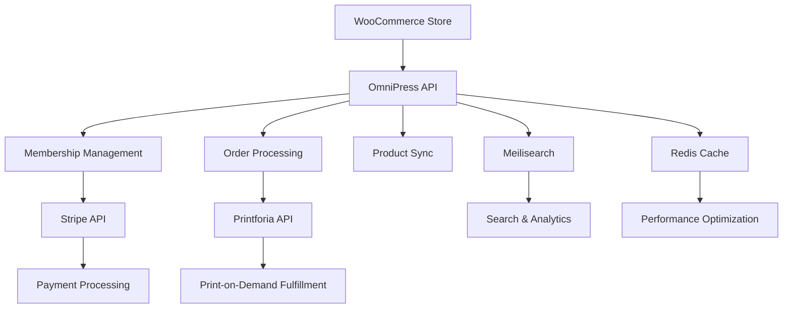

# OmniPress (Kinja App)

<p align="center"><a href="https://kindhumans.com" target="_blank"></a></p>

## What is OmniPress?

OmniPress (also known as Kinja App) is a comprehensive web application designed to manage and orchestrate various aspects of the Kindhumans e-commerce ecosystem. It serves as a central management platform that integrates with multiple external services to provide a unified experience for managing memberships, orders, products, and fulfillment operations.

### Core Purpose

The application acts as a **middleware layer** between the main Kindhumans WooCommerce store and various third-party services, providing:

- **Membership Management**: Handle subscription-based memberships with automated renewals, gift selections, and cash rewards
- **Order Orchestration**: Sync and manage orders between WooCommerce and fulfillment partners
- **Product Synchronization**: Keep product catalogs synchronized across different platforms
- **Print-on-Demand Integration**: Seamlessly integrate with Printforia for custom product fulfillment
- **Payment Processing**: Manage payment methods and subscription billing through Stripe/Cashier
- **Analytics & Reporting**: Provide insights into customer behavior, membership performance, and order analytics

### Key Integrations

- **WooCommerce**: Primary e-commerce platform integration
- **Printforia**: Print-on-demand fulfillment service
- **Stripe**: Payment processing and subscription management
- **Meilisearch**: Fast search functionality
- **Redis**: Caching and session management
- **PostgreSQL**: Primary database

## Installation

### Prerequisites

- **PHP 8.1+**
- **Composer**
- **Node.js & NPM**
- **Docker & Docker Compose** (recommended for local development)

### Option 1: Using Laravel Sail (Recommended)

Laravel Sail provides a Docker-based development environment that handles all dependencies automatically.

1. **Clone the repository**
   ```bash
   git clone <repository-url>
   cd OmniPress
   ```

2. **Install PHP dependencies**
   ```bash
   composer install
   ```

3. **Install Node.js dependencies**
   ```bash
   npm install
   ```

4. **Set up environment variables**
   ```bash
   cp .env.example .env
   php artisan key:generate
   ```

5. **Start the development environment**
   ```bash
   ./vendor/bin/sail up -d
   ```

6. **Run database migrations**
   ```bash
   ./vendor/bin/sail artisan migrate
   ```

7. **Build frontend assets**
   ```bash
   ./vendor/bin/sail npm run dev
   ```

### Option 2: Local Installation

If you prefer to install dependencies locally:

1. **Install system requirements**
   - PHP 8.1+ with extensions: BCMath, Ctype, cURL, DOM, Fileinfo, JSON, Mbstring, OpenSSL, PCRE, PDO, Tokenizer, XML
   - PostgreSQL 13+
   - Redis
   - Meilisearch
   - Mailhog (for email testing)

2. **Follow steps 1-4 from Option 1**

3. **Configure your .env file** (see Configuration section below)

4. **Run the application**
   ```bash
   php artisan serve
   npm run dev
   ```

### Configuration

#### Essential Environment Variables

```env
# Application
APP_NAME="OmniPress"
APP_URL=http://localhost:8000
FRONTEND_URL=http://localhost:8000

# Database (PostgreSQL)
DB_CONNECTION=pgsql
DB_HOST=127.0.0.1
DB_PORT=5432
DB_DATABASE=omnipress
DB_USERNAME=postgres
DB_PASSWORD=your_password

# WooCommerce Integration
WOO_CUSTOMER_DOMAIN=https://your-woocommerce-store.com
WOO_CUSTOMER_KEY=your_woocommerce_consumer_key
WOO_CUSTOMER_SECRET=your_woocommerce_consumer_secret

# Printforia Integration
PRINTFORIA_API_KEY=your_printforia_api_key
PRINTFORIA_API_URL=https://api-sandbox.printforia.com/v2/

# Stripe (for payments)
STRIPE_KEY=your_stripe_public_key
STRIPE_SECRET=your_stripe_secret_key
STRIPE_WEBHOOK_SECRET=your_stripe_webhook_secret

# Cache & Search
REDIS_HOST=127.0.0.1
REDIS_PASSWORD=null
REDIS_PORT=6379

SCOUT_DRIVER=meilisearch
MEILISEARCH_HOST=http://127.0.0.1:7700
MEILISEARCH_KEY=your_meilisearch_key

# Mail (for development)
MAIL_MAILER=smtp
MAIL_HOST=127.0.0.1
MAIL_PORT=1025
MAIL_USERNAME=null
MAIL_PASSWORD=null
MAIL_ENCRYPTION=null
```

## Project Organization

### Architecture Overview

OmniPress follows a **modular architecture** with clear separation of concerns:

```
app/
├── Actions/           # Business logic actions (Laravel Actions pattern)
├── Analytics/         # Analytics and reporting services
├── Casts/            # Eloquent model casts
├── Console/          # Artisan commands
├── Data/             # Data transfer objects and resources
├── DTOs/             # Data transfer objects
├── Enums/            # PHP enumerations
├── Events/           # Application events
├── Exceptions/       # Custom exception handlers
├── Exports/          # Data export functionality
├── Helpers/          # Utility helper classes
├── Http/             # HTTP layer (Controllers, Middleware, Requests, Resources)
├── Imports/          # Data import functionality
├── Jobs/             # Background job classes
├── Listeners/        # Event listeners
├── Mail/             # Email templates and classes
├── Models/           # Eloquent models
├── Notifications/    # Notification classes
├── Observers/        # Model observers
├── Policies/         # Authorization policies
├── Providers/        # Service providers
├── Rules/            # Validation rules
├── Services/         # Business logic services
├── Tasks/            # Task management classes
└── View/             # View components
```

### Key Modules

#### 1. **Membership Management** (`app/Models/Membership.php`)
- Handles subscription-based memberships
- Manages membership statuses (active, cancelled, expired, in_renewal)
- Integrates with Stripe for payment processing
- Supports gift selection and KindCash rewards

#### 2. **WooCommerce Integration** (`app/Services/WooCommerce/`)
- **WooCommerceService**: Main service for API communication
- **Tasks**: Synchronization tasks for customers, products, orders, coupons
- **Models**: Local representations of WooCommerce entities
- **Actions**: Business logic for WooCommerce operations

#### 3. **Printforia Integration** (`app/Services/Printforia/`)
- **PrintforiaApiClient**: API client for Printforia services
- **PrintforiaService**: Business logic for print-on-demand operations
- **Models**: Printforia order and item management
- **Jobs**: Background processing for order fulfillment

#### 4. **API Layer** (`routes/api/`)
- **V1 API**: Core functionality endpoints
- **V2 API**: Enhanced membership management
- **Authentication**: Sanctum-based API authentication
- **Rate Limiting**: Built-in API rate limiting

#### 5. **Frontend** (`resources/js/`)
- **Vue.js 3**: Modern reactive frontend
- **Inertia.js**: SPA-like experience without API complexity
- **Tailwind CSS**: Utility-first styling
- **Chart.js**: Analytics and reporting visualizations

### Database Structure

The application uses PostgreSQL with the following key tables:

- **memberships**: Core membership data and status
- **orders**: WooCommerce order synchronization
- **products**: Product catalog management
- **customers**: Customer data and payment methods
- **printforia_orders**: Print-on-demand order tracking
- **sync_logs**: Synchronization history and status

### Service Integration Flow



## API Endpoints

### Core Endpoints

#### Memberships (`/api/v1/memberships/`)
- `GET /` - List memberships
- `GET /{id}` - Get specific membership
- `POST /new` - Create new membership
- `POST /renew` - Renew existing membership
- `POST /pick-gift` - Select membership gift
- `POST /cancell/{id}` - Cancel membership
- `POST /{id}/cash/add` - Add KindCash
- `POST /{id}/cash/redeem` - Redeem KindCash

#### Synchronization (`/api/v1/sync/`)
- `GET /` - Get sync status
- `POST /sync-resource` - Sync specific resource
- `POST /bulk-sync` - Bulk synchronization
- `POST /orders/{id}/update` - Update specific order
- `POST /products/{id}/update` - Update specific product

#### Payments (`/api/v1/payments/`)
- `POST /direct` - Process direct payment
- `GET /{customer_id}/payment-methods` - Get customer payment methods
- `POST /add` - Add payment method
- `POST /delete` - Delete payment method
- `POST /set-default` - Set default payment method

#### Printforia (`/api/v1/printforia/`)
- `GET /orders/{orderId}` - Get Printforia order details
- `POST /webhook-values/{orderId}` - Process webhook data

## Development Workflow

### Running Tests
```bash
# Using Sail
./vendor/bin/sail test

# Local installation
./vendor/bin/pest
```

### Code Quality
```bash
# Laravel Pint (code formatting)
./vendor/bin/sail pint

# Generate IDE helpers
./vendor/bin/sail artisan ide-helper:models
```

### Database Management
```bash
# Run migrations
./vendor/bin/sail artisan migrate

# Seed database
./vendor/bin/sail artisan db:seed

# Create new migration
./vendor/bin/sail artisan make:migration create_example_table
```

### Queue Management
```bash
# Process jobs
./vendor/bin/sail artisan queue:work

# Monitor failed jobs
./vendor/bin/sail artisan queue:failed
```

## Notes and Possible Improvements

### Current Strengths
- **Modular Architecture**: Well-organized codebase with clear separation of concerns
- **Comprehensive Integration**: Robust integration with multiple third-party services
- **Modern Tech Stack**: Uses latest Laravel features, Vue.js 3, and modern tooling
- **API-First Design**: Well-structured API endpoints for external integrations
- **Background Processing**: Proper use of queues for heavy operations

### Areas for Improvement

#### 1. **Documentation**
- **API Documentation**: Consider implementing OpenAPI/Swagger documentation
- **Code Documentation**: Add more comprehensive PHPDoc comments
- **Deployment Guide**: Create production deployment documentation
- **Integration Guides**: Document third-party service setup procedures

#### 2. **Testing**
- **Test Coverage**: Increase test coverage, especially for business logic
- **Integration Tests**: Add more comprehensive integration tests
- **API Testing**: Implement automated API testing
- **Performance Tests**: Add load testing for critical endpoints

#### 3. **Performance**
- **Caching Strategy**: Implement more sophisticated caching strategies
- **Database Optimization**: Add database indexing and query optimization
- **API Rate Limiting**: Implement more granular rate limiting
- **Background Job Optimization**: Optimize queue processing and job handling

#### 4. **Security**
- **API Security**: Implement API versioning and deprecation strategies
- **Input Validation**: Strengthen input validation and sanitization
- **Audit Logging**: Add comprehensive audit logging for sensitive operations
- **Security Headers**: Implement security headers and CSRF protection

#### 5. **Monitoring & Observability**
- **Application Monitoring**: Implement application performance monitoring (APM)
- **Error Tracking**: Add comprehensive error tracking and alerting
- **Health Checks**: Implement health check endpoints for all services
- **Metrics Collection**: Add business metrics and KPI tracking

#### 6. **Developer Experience**
- **Development Tools**: Add more development utilities and helpers
- **Code Generation**: Implement code generation tools for common patterns
- **Local Development**: Improve local development setup and tooling
- **CI/CD Pipeline**: Implement automated testing and deployment pipelines

#### 7. **Scalability**
- **Microservices Consideration**: Evaluate breaking into smaller services
- **Database Sharding**: Consider database sharding for large datasets
- **CDN Integration**: Implement CDN for static assets
- **Load Balancing**: Add load balancing strategies

### Recommended Next Steps

1. **Immediate (1-2 weeks)**
   - Add comprehensive API documentation
   - Implement health check endpoints
   - Add more unit tests for critical business logic

2. **Short-term (1-2 months)**
   - Implement application monitoring
   - Add comprehensive error tracking
   - Create deployment automation

3. **Medium-term (3-6 months)**
   - Optimize database queries and add proper indexing
   - Implement advanced caching strategies
   - Add comprehensive integration tests

4. **Long-term (6+ months)**
   - Evaluate microservices architecture
   - Implement advanced analytics and reporting
   - Consider implementing event sourcing for critical business events

---

## Contributing

1. Fork the repository
2. Create a feature branch (`git checkout -b feature/amazing-feature`)
3. Commit your changes (`git commit -m 'Add some amazing feature'`)
4. Push to the branch (`git push origin feature/amazing-feature`)
5. Open a Pull Request

## License

This project is proprietary software developed for Kindhumans. All rights reserved.

## Support

For support and questions, please contact the development team or create an issue in the project repository.